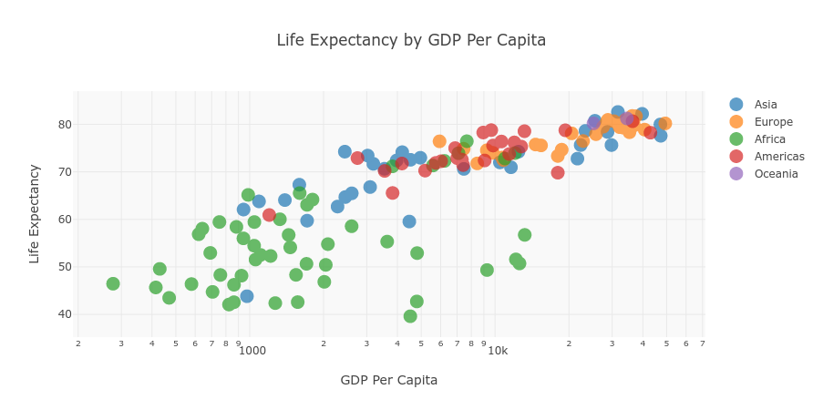

# Life Expectancy by GDP Per Capita



This Dash app displays a scatter plot of the life expectancies and GDP per capita of countries on 5 continents ranging from 1952-2007

## Setup

Download the code locally

```
$ git clone https://github.com/dto26/life-expectancy-and-gdp-per-capita-dashboard.git
```

Make sure to have dash installed

```
$ pip install dash
```

The dashboard is hosted locally. Run `$ python app.py`
